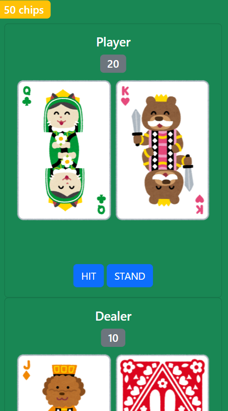

## Blackjack
This is a server application for playing Blackjack. Its main feature is a game API, but it also includes a web interface that allows you to play Blackjack directly in your browser.

### Home


### Game


### Ranking


## Technologies Used
- Laravel 11
- Nginx
- PHP 8.2
- Composer
- MySQL 8.0
- Redis
- SQLite
- Docker / Docker Compose

## Features
- User Registration and Authentication (Sign Up / Sign In)
- Play Blackjack
  - Consume stamina and play Blackjack
- Ranking System
  - View the top 10 scores and your high score

## Getting Started
Follow these steps to get this project up and run locally.

### Prerequisites
- Docker / Docker Compose

### Installation
1. Clone this repository

  ```bash
  git clone https://github.com/dino0320/blackjack.git
  cd blackjack
  ```

2. Create `.env` file
In this project root directory, create a `.env` file and copy the following contents into it.

  ```env
  APP_NAME=Blackjack
  APP_ENV=local
  APP_KEY=base64:R+veY9PQUNfNCgxRY0ZC1miDBe1zwLEUZcjNS1rC3Ls=
  APP_DEBUG=true
  APP_TIMEZONE=UTC
  APP_URL=http://localhost:8080

  APP_LOCALE=en
  APP_FALLBACK_LOCALE=en
  APP_FAKER_LOCALE=en_US

  APP_MAINTENANCE_DRIVER=file
  APP_MAINTENANCE_STORE=database

  BCRYPT_ROUNDS=12

  LOG_CHANNEL=stack
  LOG_STACK="single,stderr"
  LOG_DEPRECATIONS_CHANNEL=null
  LOG_LEVEL=debug

  DB_CONNECTION=mysql
  DB_HOST=db
  DB_PORT=3306
  DB_DATABASE=database
  DB_USERNAME=user
  DB_PASSWORD=password

  DB_DATABASE_SQLITE=database.sqlite

  SESSION_DRIVER=redis
  SESSION_LIFETIME=120
  SESSION_ENCRYPT=false
  SESSION_PATH=/
  SESSION_DOMAIN=null
  SESSION_CONNECTION=default

  BROADCAST_CONNECTION=log
  FILESYSTEM_DISK=local
  QUEUE_CONNECTION=database

  CACHE_STORE=redis
  CACHE_PREFIX=

  MEMCACHED_HOST=127.0.0.1

  REDIS_CLIENT=phpredis
  REDIS_HOST=redis
  REDIS_PASSWORD=null
  REDIS_PORT=6379

  MAIL_MAILER=log
  MAIL_HOST=127.0.0.1
  MAIL_PORT=2525
  MAIL_USERNAME=null
  MAIL_PASSWORD=null
  MAIL_ENCRYPTION=null
  MAIL_FROM_ADDRESS="hello@example.com"
  MAIL_FROM_NAME="${APP_NAME}"

  AWS_ACCESS_KEY_ID=
  AWS_SECRET_ACCESS_KEY=
  AWS_DEFAULT_REGION=us-east-1
  AWS_BUCKET=
  AWS_USE_PATH_STYLE_ENDPOINT=false

  VITE_APP_NAME="${APP_NAME}"

  ```

3. Start the services with Docker Compose

  ```bash
  docker compose up -d
  ```

4. Build assets
Connect to the Docker container and build assets such as CSS and Javascript.

  ```bash
  docker compose exec web bash
  cd srv/blackjack/
  npm run build
  ```

5. Access the app at http://localhost:8080/home

## API Endpoints

### Authentication

#### POST /api/sign-up
- Description: Registers a new user and returns an API token.
- Request body:
  ```json
  {
    "user_name": "Test",
    "device_name": "Chrome"
  }
  ```
- Response: Returns an API token.

#### POST /api/sign-in
- Description: Authenticates the user and issues a new API token.
- Request Header: Add the following into the header. Use token obtained from `/api/sign-up`.
  ```http
  Authorization: Bearer 1|{token}
  ```
- Response: Returns an API token and the user's stamina.

### Game

#### POST /api/create-game-data
- Description: Initializes the required data to start the game.
- Request Header: Add the following into the header. Use token obtained from `/api/sign-up` or `/api/sign-in`.
  ```http
  Authorization: Bearer 1|{token}
  ```
- Response: Returns the user's stamina.

#### POST /api/start-blackjack
- Description: Starts a new Blackjack game. Consumes the user's stamina.
- Request Header: Add the following into the header. Use token obtained from `/api/sign-up` or `/api/sign-in`.
  ```http
  Authorization: Bearer 1|{token}
  ```

#### POST /api/finish-blackjack
- Description: Finishes the Blackjack game. Stores the user's score.
- Request Header: Add the following into the header. Use token obtained from `/api/sign-up` or `/api/sign-in`.
  ```http
  Authorization: Bearer 1|{token}
  ```
- Request Body:
  ```json
  {
    "score": 100
  }
  ```

### Ranking

#### POST /api/get-ranking
- Description: Gets the top 10 scores and the user's high score.
- Request Header: Add the following into the header. Use token obtained from `/api/sign-up` or `/api/sign-in`.
  ```http
  Authorization: Bearer 1|{token}
  ```
- Response:
  ```json
  {
    "users": [
      {"rank": 1, "user_name": "Test2", "high_score": 200},
      ...
    ],
    "high_score": 100
  }
  ```

## License

The Laravel framework is open-sourced software licensed under the [MIT license](https://opensource.org/licenses/MIT).
