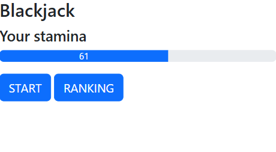
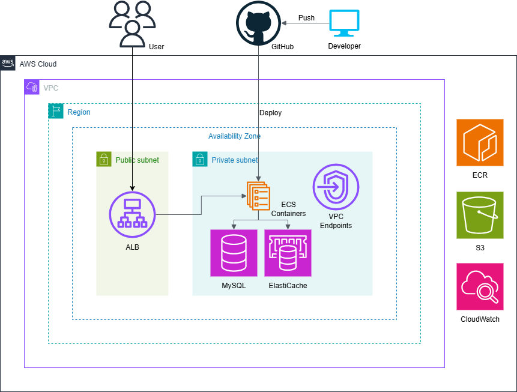

## Blackjack
This is a server application for playing Blackjack. Its main feature is a game API, but it also includes a web interface that allows you to play Blackjack directly in your browser.

This project features automated deployment to AWS using GitHub Actions.  
Access to the live application is available upon request to help reduce hosting costs.

### Screenshots
#### Home
User's stamina automatically recovers. Authentication is handled using Laravel Sanctum.



#### Blackjack
Consume stamina to start a game. The score is managed securely on the server.


#### Ranking
View the top 10 scores and the user's high score.


## Technologies Used (Back end)
- Laravel 11
- Nginx
- PHP 8.2
- Composer
- MySQL 8.0
- Redis
- SQLite
- Docker / Docker Compose
- GitHub Actions
- AWS
  - Amazon ECS (Fargate)
  - Amazon RDS
  - Amazon ElastiCache
  - Amazon ECR
  - Amazon S3
  - Amazon CloudWatch
  - Application Load Balancer
  - VPC Endpoint

### Automated Testing / CI
This project includes PHPUnit tests set up with GitHub Actions.  
Tests run automatically before the deployment.  
Workflow file: `.github/workflows/phpunit.yml`

## Technologies Used (Front end)
- HTML
- CSS
- JavaScript
- Blade (Laravel Templating Engine)
- Vite (Asset Bundler)

## Architecture Diagram


## Features
- User Registration and Authentication (Sign Up / Sign In)
- Play Blackjack
  - Consume stamina and play Blackjack
- Ranking System
  - View the top 10 scores and your high score

## Getting Started
Follow these steps to get this project up and running locally.

### Prerequisites
- Docker / Docker Compose

### Installation
1. Clone this repository
  ```bash
  git clone https://github.com/dino0320/blackjack.git
  cd blackjack
  ```

3. Start the services with Docker Compose
  ```bash
  IS_NPM_BUILT=1 docker compose up -d
  ```

5. Access the app at http://localhost/home

## API Endpoints

### Authentication

#### POST /api/sign-up
- Description: Registers a new user and returns an API token.
- Request Body:
  ```json
  {
    "user_name": "Test",
    "device_name": "Chrome"
  }
  ```
- Response: Returns an API token.

#### POST /api/sign-in
- Description: Authenticates the user and issues a new API token.
- Request Header: Add the following into the header. Use token obtained from `/api/sign-up`.
  ```http
  Authorization: Bearer 1|{token}
  ```
- Response: Returns an API token and the user's stamina.

### Game

#### POST /api/create-game-data
- Description: Initializes the required data to start the game.
- Request Header: Add the following into the header. Use token obtained from `/api/sign-up` or `/api/sign-in`.
  ```http
  Authorization: Bearer 1|{token}
  ```
- Response: Returns the user's stamina.

#### POST /api/start-blackjack
- Description: Starts a new Blackjack game. Consumes the user's stamina.
- Request Header: Add the following into the header. Use token obtained from `/api/sign-up` or `/api/sign-in`.
  ```http
  Authorization: Bearer 1|{token}
  ```

#### POST /api/finish-blackjack
- Description: Finishes the Blackjack game. Stores the user's score.
- Request Header: Add the following into the header. Use token obtained from `/api/sign-up` or `/api/sign-in`.
  ```http
  Authorization: Bearer 1|{token}
  ```
- Request Body:
  ```json
  {
    "score": 100
  }
  ```

### Ranking

#### POST /api/get-ranking
- Description: Gets the top 10 scores and the user's high score.
- Request Header: Add the following into the header. Use token obtained from `/api/sign-up` or `/api/sign-in`.
  ```http
  Authorization: Bearer 1|{token}
  ```
- Response:
  ```json
  {
    "users": [
      {"rank": 1, "user_name": "Test2", "high_score": 200},
      ...
    ],
    "high_score": 100
  }
  ```

## License

The Laravel framework is open-sourced software licensed under the [MIT license](https://opensource.org/licenses/MIT).
