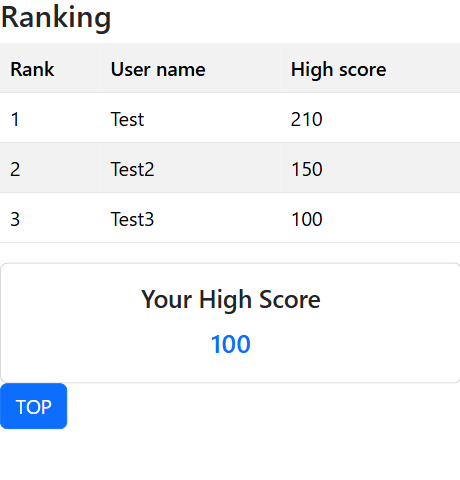

## Blackjack
This is a server application for playing Blackjack. Its main feature is a game API, but it also includes a web interface that allows you to play Blackjack directly in your browser.

## Technologies Used
- Laravel 11
- Nginx
- PHP 8.2
- Composer
- MySQL 8.0
- Redis
- SQLite
- Docker / Docker Compose

## Features
- User Registration and Authentication (Sign Up / Sign In)
- Play Blackjack
  - Consume stamina and play Blackjack
- Ranking System
  - View the top 10 scores and your high score

## License

The Laravel framework is open-sourced software licensed under the [MIT license](https://opensource.org/licenses/MIT).
